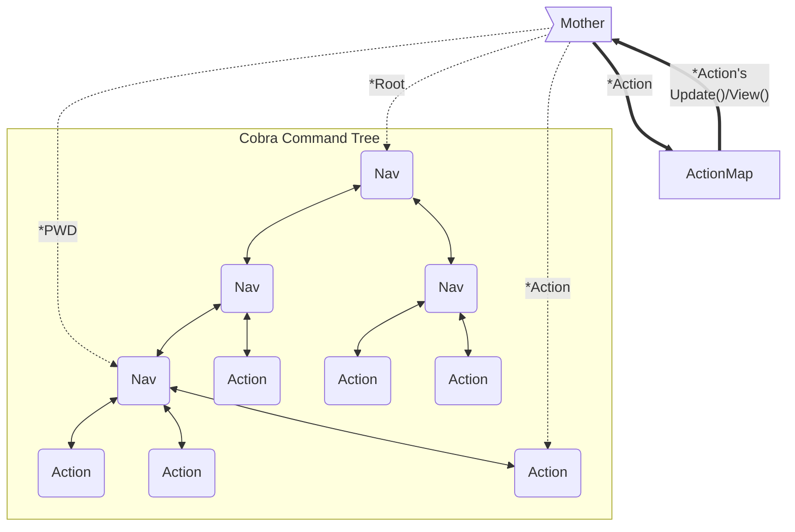
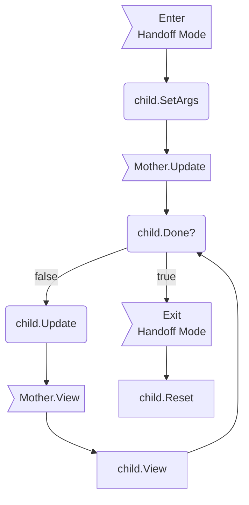

# Overview
gwcli is built to allow more functionality to be easily plugged in. As such, it follows design principles closer to that of a toolbox or framework. For instance, [list scaffolding](utilities/scaffold/list) provides complete functionality for listing any kind of data in a unified way while requiring minimal new code. The goal is to genericize as much as possible, so future developers can simply call these genericized subrotuines.

# Keep In Mind

- Actions' Update subroutines should *always* return a tea.Cmd when handing control back to Mother.

    - If you do not have anything to tea.Println on completion, use a .Blink method

- Remember that this is a prompt; anything not immediately interactive should be output via tea.Print* as history, rather than in the .View() that will be lost on redraw. 

- Do not include newlines in lipgloss renders. It produces weird results.

# More on Design

## "Global" Variables

A number of development features exist as global singletons driven by static subroutines operating on a single, underlying variable instance.

- `action.go` covers the action map for adding interactive models to Actions.

- A single, shared connection to the Gravwell instance, via the Client library, is serviced by the connection package in `connection.go`.

- `clilog.go` maintains a shared logger for developer logs. It is a shared instance of the gravwell ingest logger.

### Why?

Because the program must be usable from any number of different entry-points and scenarios, it does not have a central "app" struct or similar for hosting widely-shared resources. Cobra and Mother need access to similar resources, without being able to assume who owns or has utilized what.

Similarly, while there are no current plans to implement threading, a singleton is trivial to enforce locks on, especially in software with flexibility in coarseness of locking. 

## Cobra/Bubble Tea Interop

Mother operates on top of an underlying cobra.Command tree, using it for navigation and argument parsing.

Because cobra.Commands cannot support the methods requied to directly interoperate with Bubble Tea, a pre-generated hashtable maps cobra.Commands to their associated Actor interfaces.
Mother keeps track of the active Action (leaf cobra.Command) and looks up its methods in this hashtable. 



### Why?

We want to rely on Cobra as much as possible; it has all the navigational features we need and the further we stray from it, the less we benefit from its auto-generation capabilities.

However, Mother cannot hand off control to a cobra.Command leaf (an *Action*) because it does not have `.Update()` and `.View()` methods to supplant her own. We cannot add methods to non-local structs.

With Type Embedding, an Action struct could embed cobra.Command and implement `.Update()` and `.View()` (basically: `class Action extends cobra.Command implements tea.Model` in OOP parlance). That way, it has all the subroutines Cobra will invoke in non-interactive mode and the two we need when driving Bubble Tea.

Solved, right? Not quite. The relationship must be bi-directional, which is not feasible.

Clock this signature `.AddCommand(cmds ...*cobra.Command)`. To get commands into Cobra's tree so it can work its magic, we need to supply a cobra.Command *struct*. Due to the way Go's quasi-inheritance works, we cannot masquerade our Action 'super' type as its 'base'. We can supply cobra with a pointer to the embedded type. ex: 

```go
a := &action.Action{Command: cobra.Command{}}

root.AddCommand(a.Command)
```

This, however, will dispose of our super wrapper `a` as soon as it falls out of scope.

We have a few options:

1) Maintain two, separate-but-topologically-identical trees using two different structures. We retain the normal cobra.Command tree and a parallel tree for Mother to operate on. This decouples Cobra and Mother, allowing them total flexibility in data representation, but could lead to significant data duplication and difficulty guaranteeing equity when adding new commands or performing maintenance. Given Cobra provides all required data for navigation and Nav nodes, this feels a bit like reinventing the wheel just to tack on a couple methods for the tree's leaves.

2) Maintain a data structure of Actions within Mother so we can look up subroutines associated to it when called. This keeps Cobra and Mother paired and allows us to continue leveraging Cobra's tree directly without maintaining a parallel tree. On the other hand, it separates Actions from their subroutines somewhat significantly and would require care to ensure equity, similar to the parallel trees of option #1. 

3) Fork Cobra, attach the required function signatures (ex: `.Update()`, `.View()`, ...) to the Cobra struct directly (or convert the cobra struct to an interface), and include the fork as a submodule. This is the most straightforward and lowest-initial-lift option. We can navigate and act *entirely* off the cobra.Command tree, supplanting Mother's Model-Update-View with that of the selected Action's stored directly inside the Action's command. However, we now how two packages to maintain, instead of just one.

While Option 3 is the most straightforward initially, future maintainers may not agree, especially as changes occur to the upstream Cobra package. Therefore, option 2 is how interoperability is designed. Mother/interactive mode can function entirely off Cobra's navigation and Cobra can operate entirely as normal. The only adaptation takes place in interactive mode, when an action is invoked; Mother uses the action cobra.Command to fetch the methods that should supplant her standard model.

## Actions

Actions must satisfy the `action.Model` interface to be able to supplant Mother as the controller. This means satisfying all 5 methods: `Update(), View(), Done(), Reset(), and SetArgs()`.

`Update(tea.Msg) tea.Cmd` is the primary driver of the action. While in handoff mode, Mother will invoke the child's `Update()` subroutine in place of her own.

`View() string`, like Update, supplants Mother's View method while in handoff mode. Note, however, that this is a prompt and all non-interactive output should instead be printed outside of Bubble Tea's control (via `tea.Print*()`).

`Done() bool` is called by mother *before handing off* each cycle. If it is true, Mother will *not* hand off and will instead reassert control and unseat the child. Generally tracked by a private variable in the child struct.

`Reset() error` is called by Mother *after* a child runs, once `Done()` returns true. It resets the child to a clean state so it can be called again later.

`SetArgs([]string) (string, []tea.Cmd, error)` sets fields in the child that manipulate its next run. It is called when Mother *first enters handoff mode* for a child. It returns, respectively: the reason this argument set is invalid (or ""), tea.Cmds the child needs run on startup (eg: right now), errors outside of the users control. The startup Cmds somewhat take the place of tea.Model.Init().



### Scaffolding

Where possible, use the functionality in the scaffold to rapidly construct new actions that fit one of the scaffold archetypes.