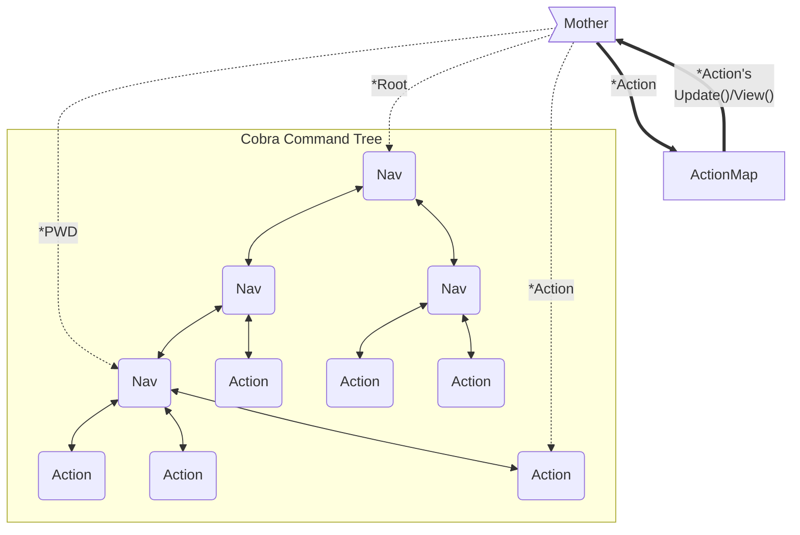

# gwcli

# Design

## Terminology

Bubble Tea has the `tea.Model` interface that must be implemented by a model struct of our own. Bubbles.TextInput is a tea.Model under the hood. Cobra is composed of `cobra.Commands` and Bubble Tea drives its I/O via `tea.Cmds`. CLI invocation is composed of commands, arguments, and flags.

So we are using our own terminology to avoid further homonyms. 

Our Bubble Tea model implementation, our controller, is *Mother*.

Tree leaves (commands that can be invoked interactively or from a script), such as `search`, are *Actions*.

Tree nodes, commands that require further input, such as `admin`, are *Navs*.


## Cobra/Bubble Tea Interop

Mother operates on top of an underlying cobra.Command tree, using it for navigation and argument parsing.

Because cobra.Commands cannot support the methods requied to directly interoperate with Bubble Tea, a pre-generated hashtable maps cobra.Commands to their associated Actor interfaces.
Mother keeps track of the active Action (leaf cobra.Command) and looks up its methods in this hashtable. 



### Why This Method?

We want to rely on Cobra as much as possible; it has all the navigational features we need and the further we stray from it, the less we benefit from its auto-generation capabilities.

However, Mother cannot hand off control to a cobra.Command leaf (an *Action*) because it does not have `.Update()` and `.View()` methods to supplant her own. We cannot add methods to non-local structs.

With Type Embedding, an Action struct could embed cobra.Command and implement `.Update()` and `.View()` (basically: `class Action extends cobra.Command implements tea.Model` in OOP parlance). That way, it has all the subroutines Cobra will invoke in non-interactive mode and the two we need when driving Bubble Tea.

Solved, right? Not quite. The relationship must be bi-directional, which is not feasible.

Clock this signature `.AddCommand(cmds ...*cobra.Command)`. To get commands into Cobra's tree so it can work its magic, we need to supply a cobra.Command *struct*. Due to the way Go's quasi-inheritance works, we cannot masquerade our Action 'super' type as its 'base'. We can supply cobra with a pointer to the embedded type. ex: 

```go
a := &action.Action{Command: cobra.Command{}}

root.AddCommand(a.Command)
```

This, however, will dispose of our super wrapper `a` as soon as it falls out of scope.

We have a few options:

1) Maintain two, separate-but-topologically-identical trees using two different structures. We retain the normal cobra.Command tree and a parallel tree for Mother to operate on. This decouples Cobra and Mother, allowing them total flexibility in data representation, but could lead to significant data duplication and difficulty guaranteeing equity when adding new commands or performing maintenance. Given Cobra provides all required data for navigation and Nav nodes, this feels a bit like reinventing the wheel just to tack on a couple methods for the tree's leaves.

2) Maintain a data structure of Actions within Mother so we can look up subroutines associated to it when called. This keeps Cobra and Mother paired and allows us to continue leveraging Cobra's tree directly without maintaining a parallel tree. On the other hand, it separates Actions from their subroutines somewhat significantly and would require care to ensure equity, similar to the parallel trees of option #1. 

3) Fork Cobra, attach the required function signatures (ex: `.Update()`, `.View()`, ...) to the Cobra struct directly, and include the fork as a submodule. This is the most straightforward and lowest-initial-lift option. We can navigate and act *entirely* off the cobra.Command tree, supplanting Mother's Model-Update-View with that of the selected Action's stored directly inside the Action's command. However, we now how two packages to maintain, instead of just one.   

While Option 3 seems like the best option right now, future maintainers may not agree, especially as changes occur to the upstream Cobra package. Therefore, option 2 is how interoperability is currently designed. Mother/interactive mode can function entirely off Cobra's navigation and Cobra can operate entirely as normal. The only adaptation takes place in interactive mode, when an action is invoked; Mother uses the action cobra.Command to fetch the methods that should supplant her standard model.

*If you can figure a better adaption pattern, I am all ears.*